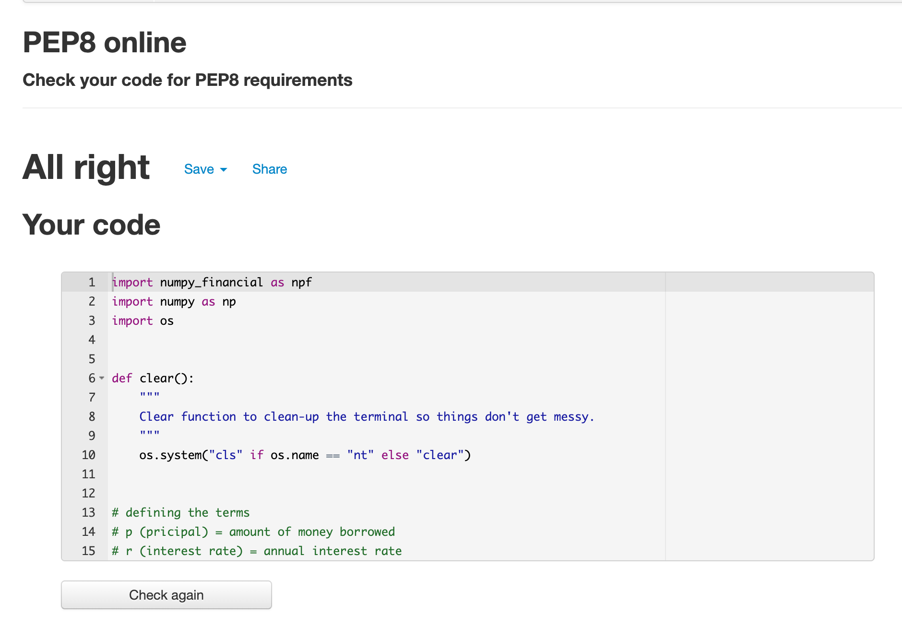

# FinAid-Loan-Calculator

FinAid-Loan-Calculator is a Python terminal based calculator that computes the monthly payment amount, the total amount of payment upto maturity and the cost of borrowing based on the inputs provided by the user. This program runs on Code Institute mock terminal heroku. 

The terminal loan calculator enables the users to type in new input values for the principal amount, interest rate and loan period to find out the corresponding monthly loan payment, the total amount of payment upto maturity and the total cost of borrowing.

## How to use the calculator

- The user starts the terminal loan calculator by clicking the 'Run Program' button on heroku. 

- The screen displays a welcome message and asks if the user wants to calculate his/her loan. There are 'yes' or 'no' alternatives.

    - If the user types 'no' a thank you message will be displayed and tells the user what to do if they want to calculate their loan.

    -  If the user types 'yes', the loan calculator asks the user to enter the principal (the initial size of a loan), the expected annual interest rate and the loan period (the length of time it will take to pay off the loan)in years.

- After entering the above variables and clicking enter, the monthly installment amount that should be paid, the total amount of loan (including the prinicipal amount and the interest rate) at the end of the loan period and the cost of borrowing will be disposed.

- After getting the results, the user will be asked if he/she wants to try again with a different input value.

## Existing Features

- Accepts the three inputs namely the principal amount, the interest rate and the loan time period from the user and display three outputs which are the monthly installment amount, the total amount of loan upto maturity and the cost of loan. 

- Input validation and error checking

    - the loan calculator has input validation mechanism. The user is expected to enter an integer number both in principal amount and time period and a float number when entering the annnual interest rate. Otherwise an error message will be shown. 

    - The user cannot enter a string, a letter,  a space or special characters.

## Future features left to implement

- FinAid Loan calculator should generate an amortization schedule.

- It should send an email that contains a payment schedule details to the user. 

- It should allow to plot a graph for different loan scenarios.

## Validator Testing 

 - The code is tested and passed through [http://pep8online.com/]
 

 

## Bugs 

- No bugs were discovered when running the code.

## Deployment

This project is deployed using Code Institute's mock terminal for Heroku. 
 - steps for deployment 
     - All dependencies were placed in the `requirements.txt` file
     - Fork or clone the repository 
     - Set the buildpacks to python and NodeJS
     - Add the two buildpacks  `heroku/python` and `heroku/nodejs` from the Settings_ tab with the given order.
     - Create a _Config Var_ called `PORT` with Set this to `8000`
     - Link the Heroku app to the repository
    - Click on deploy
 
- Numpy financial was loaded to enable financial functions.
 

## credits

-  Code Institute for creating the deployment terminal Heroku 
- The following links were used to clean the terminal.
-  [https://www.geeksforgeeks.org/clear-screen-python/]
-  [https://stackoverflow.com/questions/2084508/clear-terminal-in-python]

## Constraints

The deployment terminal is set to 80 columns by 24 rows. That means that each line of text needs to be 80 characters or less otherwise it will be wrapped onto a second line.

